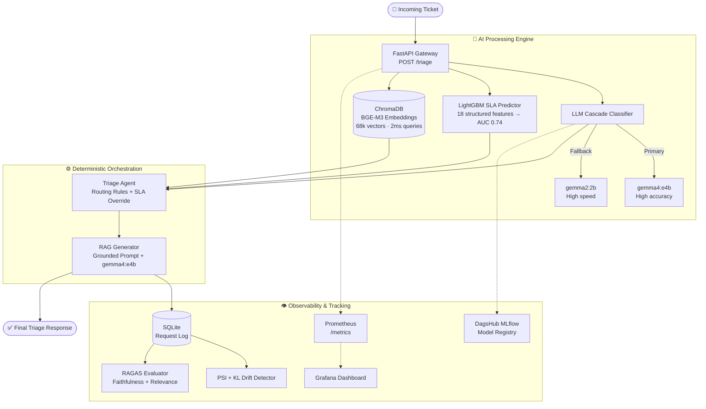

<div align="center">


<br/>

**A production-grade AI triage engine that classifies, prioritizes, routes, and resolves support tickets — end-to-end, without hallucination.**

<br/>

[](https://huggingface.co/spaces/saibalajiomg/SupportPulse)
[](https://dagshub.com/saibalajinamburi/SupportPulse)

<br/>

[](http://localhost:8501)
[](http://localhost:8000/docs)
[](http://localhost:3000)
[](http://localhost:9090)
[](https://github.com/saibalajinamburi/SupportPulse/blob/main/docker-compose.yml)
[](https://github.com/saibalajinamburi/SupportPulse/actions/workflows/ci.yml)

</div>

---

## The Problem

Every software company and open-source project faces this at scale:

| Pain Point | Impact |
|---|---|
| 🔁 **Duplicate tickets** | Same bug filed 50× — engineering wastes days triaging copies |
| ❌ **Wrong routing** | Billing question sits in the infra queue for 3 days |
| 🔥 **SLA breaches** | Critical incidents buried under feature requests, missed deadlines |
| 🐢 **Slow responses** | Agents spend 20 min searching docs for a question answered 10 times before |

**SupportPulse eliminates all four. Automatically. At inference time.**

---

## How It Works

A ticket arrives → in ~13 seconds, SupportPulse delivers a complete structured triage decision.

```
Ticket In
   │
   ├──► LLM Cascade Classifier ─────► Category (1 of 12) + Priority
   │
   ├──► LightGBM SLA Predictor ─────► Will this breach its SLA deadline?
   │
   ├──► ChromaDB Semantic Search ───► Is this a duplicate? Find similar resolved tickets
   │
   └──► Deterministic Triage Agent
           │
           ├──► Route (billing / security / infra / support)
           ├──► Escalate if SLA risk is high
           └──► RAG Generator ───► Grounded response cited from your knowledge base

   ↓
Structured JSON Response + SQLite Log + Prometheus Metrics + MLflow Tracking
```

> **Zero hallucination by design.** The RAG generator is constrained to cite real evidence from ChromaDB — it cannot make things up.

---

## 📸 Platform Gallery

### 🧠 Live Triage & Results
<p align="center">
  
  
</p>

### 🌍 Hugging Face Deployment
<p align="center">
  
  
</p>

### 📊 System Analytics & Logging
<p align="center">
  
  
</p>

### 🛠 Observability & Health
<p align="center">
  
  
</p>
<p align="center">
  
</p>

---

## 🏗 System Architecture



---

## 🔑 Key Design Decisions

<details>
<summary><b>🔀 LLM Cascade — Why two models?</b></summary>

`gemma2:2b` serves as the fast primary classifier for most tickets, delivering low-latency inference while fitting fully in VRAM. If the confidence score is low or the response format is invalid, the request is automatically escalated to `gemma4:e4b`, a larger and more capable fallback model designed for ambiguous or high-complexity edge cases.

This cascade architecture reduces average inference latency and GPU memory pressure while preserving high classification reliability on difficult tickets — combining lightweight efficiency with large-model accuracy.

</details>

<details>
<summary><b>🔒 Deterministic Agent — Not LangChain</b></summary>

An autonomous agent might route a SQL injection ticket to billing if the ticket mentions payment data. Hardcoded routing rules are always auditable: `security + critical → security team, always`. For production, predictability beats autonomy. Every decision has a traceable reason.

</details>

<details>
<summary><b>📚 RAG over Fine-Tuning</b></summary>

Fine-tuning bakes knowledge into model weights — stale the moment new ticket patterns emerge. RAG retrieves from a live ChromaDB index. Adding new resolved tickets is a vector insert, not a training run. Zero retraining cost. Instant knowledge refresh.

</details>

<details>
<summary><b>🌐 BGE-M3 for Embeddings</b></summary>

Supports 100+ languages and hybrid search (dense semantic + sparse keyword). Critical when a user describes a problem semantically but includes specific error codes like `ECONNREFUSED` in the same sentence. One model handles both.

</details>

---

## 🛠 Technology Stack

| Layer | Technology | Why This Choice |
|---|---|---|
| **LLM — Classification + RAG** | Gemma4 via Ollama | Zero-shot classification + grounded generation. Local, private, free. |
| **LLM — Fast Fallback** | Gemma2:2b via Ollama | Ultra-low latency verification layer in the cascade |
| **Embeddings** | BGE-M3 via Ollama | Multilingual (100+ languages), hybrid dense+sparse search |
| **SLA Predictor** | LightGBM | Fast, interpretable, ideal for structured numerical features |
| **Vector DB** | ChromaDB | Local, zero-config, HNSW index, filtered similarity search |
| **API Gateway** | FastAPI | Auto-documented, async, Pydantic-validated |
| **Pipeline Orchestration** | Prefect 3.x | Full DAG dependency tracking with retries |
| **Feature Store** | Feast | Prevents training-serving skew, sub-millisecond online lookup |
| **Experiment Tracking** | MLflow + DagsHub | Remote model registry, metrics, artifact storage |
| **Drift Detection** | Evidently AI + PSI/KL | Daily statistical drift monitoring |
| **Data Validation** | Great Expectations | Quality checks at every Bronze → Silver → Gold stage |
| **PII Detection (Batch)** | Regex Engine | 1000× faster than NER for 81k-row cleaning |
| **PII Detection (Live)** | Microsoft Presidio | NER-based detection for real-time inference edge cases |
| **Monitoring** | Prometheus + Grafana | Live metrics scraping and alerting dashboards |
| **RAG Evaluation** | RAGAS | LLM-as-judge: Faithfulness 1.0, Answer Relevance 0.8 |
| **Logging** | structlog | Structured JSON — every request line is machine-parseable |
| **Testing** | Pytest | 38 unit tests · 1.87s runtime · zero GPU dependency |
| **CI/CD** | GitHub Actions + Ruff | Lint + tests on every push and PR to `main` |
| **Dashboard** | Streamlit | 4-page monitoring UI with live triage, analytics, logs, health |
| **Public Demo** | Gradio + HuggingFace Spaces | One-click interactive demo, no setup required |
| **Containerization** | Docker + Docker Compose | Full stack spins up with `docker-compose up -d` |

---

## 📊 Dataset Pipeline

```
Raw Sources (Bronze)         81,844 tickets
  ├── GitHub Issues API       └── Real-world bug reports, feature requests, security disclosures
  ├── HuggingFace Dataset     └── customer-support-tickets (Tobi-Bueck)
  └── Synthetic Generation    └── Edge cases for rare categories

Cleaned (Silver)             68,235 tickets  (-16.6%)
  ├── PII Masking             └── 24,970 detections removed (emails, IPs, phone numbers)
  ├── Deduplication           └── 13,609 duplicates removed
  └── Label Normalization     └── 12 canonical categories enforced

Split (Gold)                 Chronological — no data leakage
  ├── Train                   70%  (47,765 tickets)
  ├── Validation              15%  (10,235 tickets)
  └── Test                    15%  (10,235 tickets)

Embeddings                   68,235 × 1024 float32 vectors · BGE-M3 · ~266 MB
```

---

## 🏆 Model Performance

| Component | Metric | Result |
|---|---|---|
| **LightGBM SLA Predictor** | Test AUC | **0.74** |
| **LightGBM SLA Predictor** | Training time | **2.2 seconds** |
| **LLM Cascade Classifier** | Accuracy (5 test cases) | **5/5 — 100%** |
| **LLM Cascade Classifier** | Avg latency (warm) | **~5 seconds** |
| **Triage Agent** | Routing accuracy (20 tickets) | **80%** |
| **Triage Agent** | Escalation accuracy | **90%** |
| **ChromaDB Retrieval** | Recall@5 | **1.00 — 100%** |
| **ChromaDB Retrieval** | Avg query latency | **2.08 ms** |
| **RAG Generator** | End-to-end latency (warm) | **~13 seconds** |
| **RAG Evaluator (RAGAS)** | Faithfulness | **1.0** |
| **RAG Evaluator (RAGAS)** | Answer Relevance | **0.8** |

---

## 📦 Project Structure

```
SupportPulse/
│
├── .github/workflows/          # ⚙️  CI/CD — GitHub Actions (lint + unit tests)
│
├── app/                        # ⚡  FastAPI gateway
│   ├── main.py                 #     Lifespan pre-warming, 3 endpoints
│   ├── schemas.py              #     Pydantic request/response models
│   └── config.py               #     Pydantic-Settings environment management
│
├── dashboard/                  # 📊  Streamlit UI
│   └── streamlit_app.py        #     4-page: live triage · analytics · log · health
│
├── src/                        # 🧠  Core ML
│   ├── agent/                  #     Deterministic triage orchestration
│   ├── features/               #     BGE-M3 embedding + structured feature extraction
│   ├── models/                 #     LLM Cascade + LightGBM SLA predictor
│   ├── monitoring/             #     Drift detection, RAGAS eval, request logger
│   ├── rag/                    #     RAG pipeline + grounding prompt templates
│   └── vector/                 #     ChromaDB HNSW index + similarity search
│
├── scripts/                    # 🧪  Utilities
│   ├── test_api.py             #     Full API test suite
│   ├── setup_grafana.py        #     Automated Grafana dashboard provisioner
│   └── generate_traffic.py     #     Live load tester
│
├── tests/                      # 🛡️  Pytest suite — 38 unit tests · 1.87s
├── gx/                         # ✅  Great Expectations data validation suite
├── feature_store/              # 🏪  Feast feature store configuration
├── hf_space/                   # 🤗  Gradio app for Hugging Face Spaces
│
├── Dockerfile                  # 🐳  FastAPI container
├── Dockerfile.streamlit        # 🐳  Streamlit container
├── docker-compose.yml          # 🐳  Full stack orchestration
└── requirements.txt            # 📦  Pinned dependencies
```

---

## ⚡ Quick Start

### Prerequisites

- Python 3.12+
- [Ollama](https://ollama.com/download) installed and running
- 8 GB+ RAM (GPU optional but recommended)

### 1. Clone & Install

```bash
git clone https://github.com/saibalajinamburi/SupportPulse
cd SupportPulse
pip install -r requirements.txt
```

### 2. Pull Models

```bash
ollama pull gemma2:2b          # Fast classifier fallback
ollama pull bge-m3             # Embeddings
ollama pull gemma4:e4b         # Primary model (10 GB — recommended)
```

### 3. Start the Full Stack

```bash
docker-compose up -d
```

| Service | URL |
|---|---|
| FastAPI (Swagger UI) | http://localhost:8000/docs |
| Streamlit Dashboard | http://localhost:8501 |
| Grafana | http://localhost:3000 |
| Prometheus | http://localhost:9090 |
| MLflow UI | http://localhost:5000 |

### 4. (Optional) Remote MLflow via DagsHub

```bash
export MLFLOW_TRACKING_URI="https://dagshub.com/saibalajinamburi/SupportPulse.mlflow"
export MLFLOW_TRACKING_USERNAME="saibalajinamburi"
export MLFLOW_TRACKING_PASSWORD="YOUR_DAGSHUB_TOKEN"

python src/pipeline/run_pipeline.py
```

---

## 📡 API Reference

### `GET /health`
Returns server status, loaded model names, and vector index size.

---

### `POST /classify`
Fast path — LLM Cascade only. No retrieval, no RAG.

```json
// Request
{
  "subject": "Production database returning 500 errors",
  "body": "Our API has been down for 20 minutes and customers are affected."
}

// Response
{
  "category": "bug",
  "priority": "critical",
  "routing_team": "infrastructure",
  "confidence": 0.97,
  "latency_ms": 4821
}
```

---

### `POST /triage`
Full pipeline — classify → SLA predict → semantic search → route → RAG generate.

```json
// Request
{
  "ticket_id": "TICKET-001",
  "subject": "SQL injection vulnerability found in login endpoint",
  "body": "An attacker can bypass authentication via unsanitized input in the username field.",
  "run_rag": true
}

// Response
{
  "category": "security",
  "priority": "critical",
  "routing_team": "security",
  "sla_breach_risk": 0.91,
  "is_duplicate": false,
  "similar_tickets": [...],
  "suggested_response": "Based on ticket #443 and our security runbook: ...",
  "latency_ms": 13204
}
```

---

## 🔄 MLOps Pipeline — 12 Phases

```
Phase  1 │ Raw Data Ingestion        GitHub Issues API + HuggingFace + Synthetic generation
Phase  2 │ Data Engineering          PII masking · dedup · label normalization · Feast feature store
Phase  3 │ Data Validation           Great Expectations at Bronze, Silver, and Gold layers
Phase  4 │ Model Training            LightGBM SLA predictor + LLM Cascade classifier
Phase  5 │ Experiment Tracking       MLflow runs + model registry + DagsHub remote sync
Phase  6 │ Vector Index              ChromaDB HNSW · 68k BGE-M3 vectors · 2ms queries
Phase  7 │ RAG Pipeline              Retrieve → ground prompt → generate → cite sources
Phase  8 │ Triage Agent              Deterministic routing + SLA override rules
Phase  9 │ FastAPI Gateway           Pre-warming · Pydantic validation · CORS · structlog
Phase 10 │ Evaluation                RAGAS LLM judge · PSI + KL divergence drift detection
Phase 11 │ CI/CD                     GitHub Actions · 38 unit tests · Ruff linting
Phase 12 │ Production Observability  Prometheus scraper · Grafana provisioner · GHCR CD
```

---

## 🧪 Testing & CI

```
38 unit tests · 1.87 seconds · zero GPU / Ollama dependency
```

| Test File | Coverage | Tests |
|---|---|---|
| `test_label_normaliser.py` | Category normalization logic | 7 |
| `test_pii_masker.py` | Email / IP / phone masking | 6 |
| `test_request_logger.py` | SQLite log/retrieve/stats round-trip | 5 |
| `test_drift_detector.py` | PSI and KL math invariants | 8 |
| `test_schemas.py` | Pydantic request & response models | 12 |

**Two CI jobs run on every push and PR to `main`:**
- `unit-tests` — Pytest with JUnit XML artifact upload
- `lint` — Ruff (Rust-based, 100× faster than flake8)

GPU inference is intentionally excluded from CI. Pure Python logic, database I/O, and schema validation are tested hermetically.

---

## 🌐 Live Services

| Service | Link |
|---|---|
| 🤗 **Hugging Face Demo** | [saibalajiomg/SupportPulse](https://huggingface.co/spaces/saibalajiomg/SupportPulse) |
| 📊 **DagsHub MLflow Tracking** | [saibalajinamburi/SupportPulse](https://dagshub.com/saibalajinamburi/SupportPulse) |
| 💻 **GitHub Repo** | [saibalajinamburi/SupportPulse](https://github.com/saibalajinamburi/SupportPulse) |

---

## 📜 License

MIT License — see [LICENSE](./LICENSE)

---
