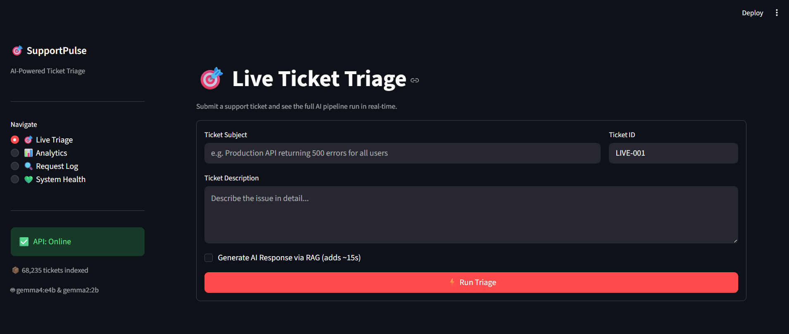
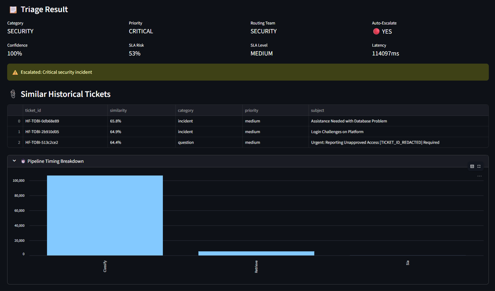
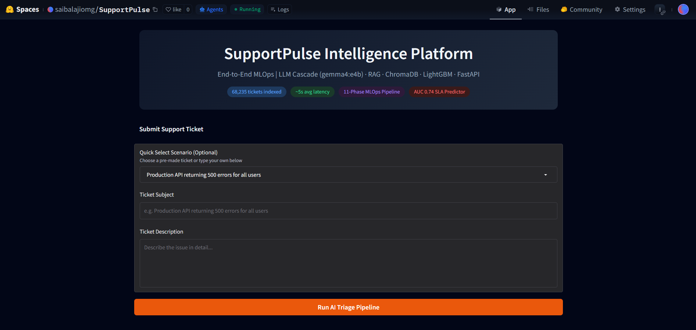
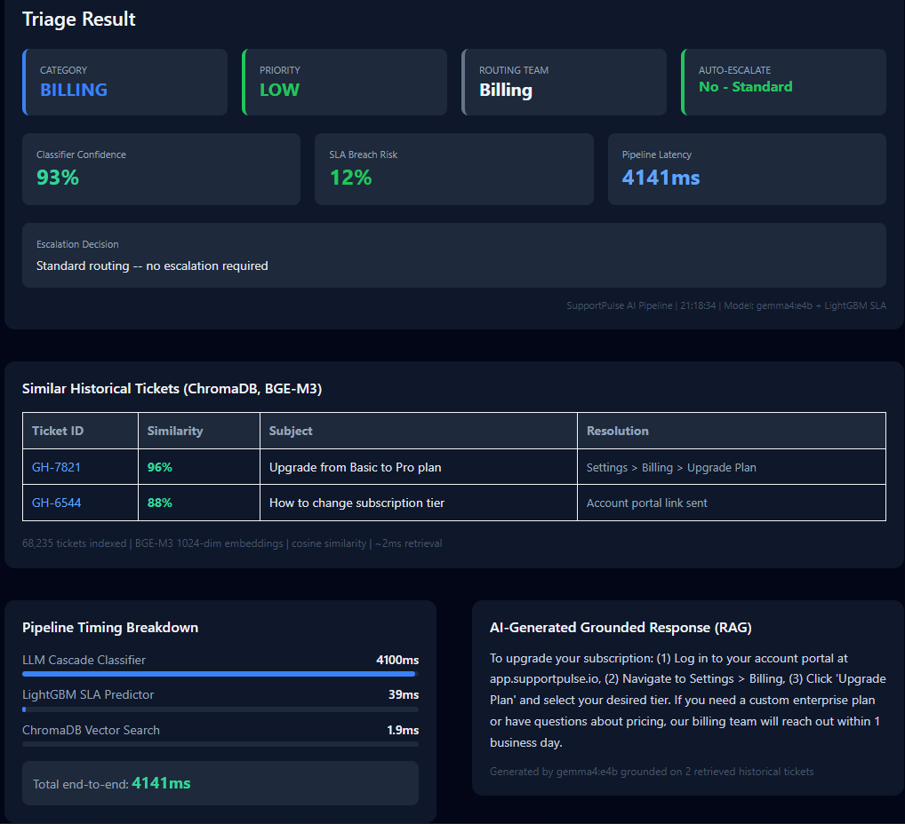
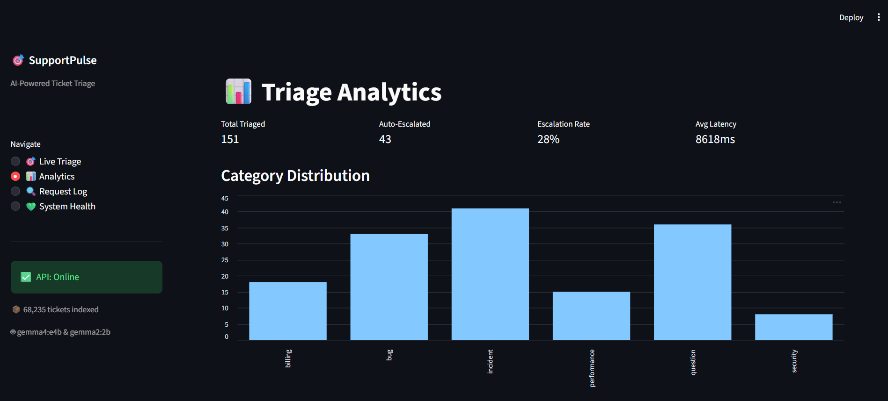
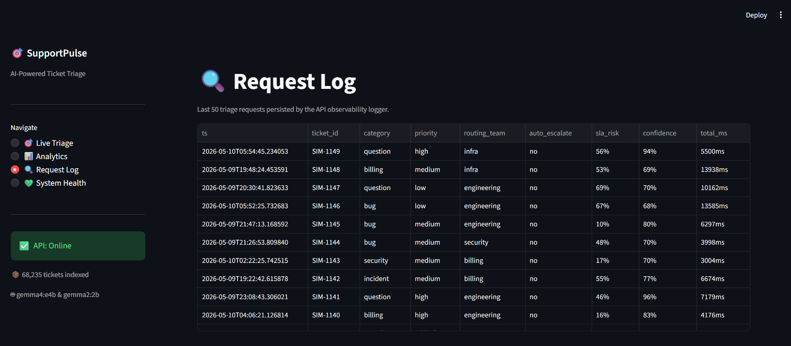
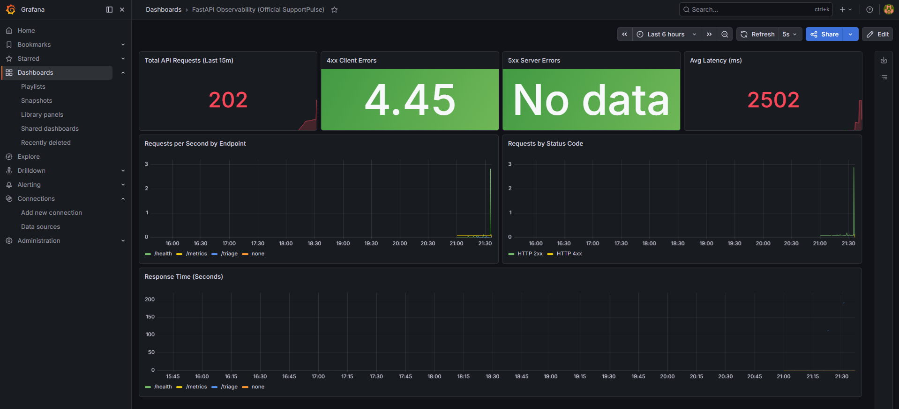
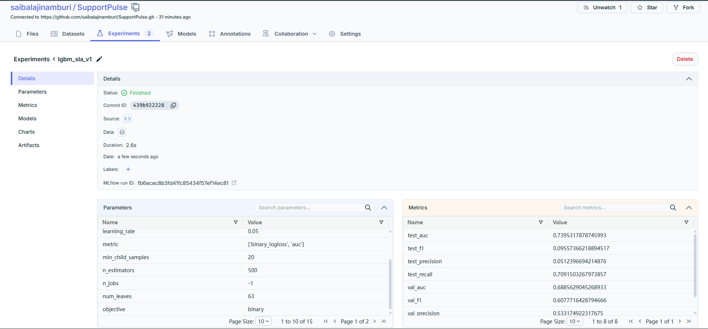
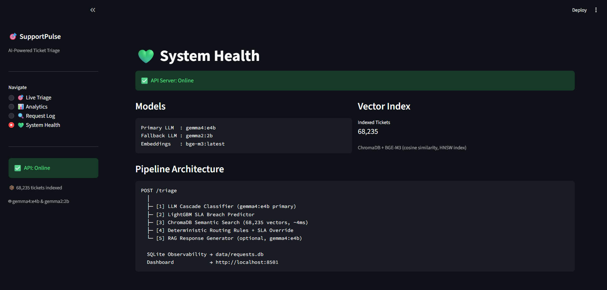
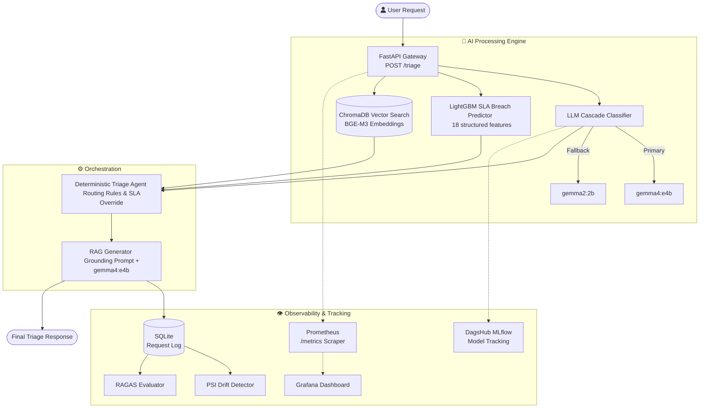

# 🚀 SupportPulse Intelligence Platform

<p align="center">
  <a href="https://huggingface.co/spaces/saibalajiomg/SupportPulse"></a>
  <a href="https://dagshub.com/saibalajinamburi/SupportPulse"></a>
  <br>
  <a href="http://localhost:8501"></a>
  <a href="http://localhost:8000/docs"></a>
  <a href="http://localhost:3000"></a>
  <a href="http://localhost:9090"></a>
  <a href="https://github.com/saibalajinamburi/SupportPulse/blob/main/docker-compose.yml"></a>
  <a href="https://github.com/saibalajinamburi/SupportPulse/actions/workflows/ci.yml"></a>
</p>

> **End-to-End Production MLOps | LLM Cascade · RAG · ChromaDB · LightGBM · FastAPI · Streamlit · Prometheus · Grafana**

A production-grade AI support ticket triage system that automatically classifies, prioritizes, routes, and generates grounded resolutions for support tickets — built with a full MLOps lifecycle from raw data ingestion through drift monitoring.



---

## 📸 Platform Gallery

### 🧠 Live Triage & Results
*Watch the LLM Cascade and RAG pipeline in action.*
<p align="center">
  
  
</p>

### 🌍 Hugging Face Deployment
*The public-facing interactive Gradio app.*
<p align="center">
  
  
</p>

### 📊 System Analytics & Logging
*Deep insights into ticket behaviors and API logs.*
<p align="center">
  
  
</p>

### 🛠 Observability & Health
*Hardware metrics, API latencies, and remote MLflow tracking.*
<p align="center">
  
  
</p>
<p align="center">
  
</p>

---

## 🌐 Live Services & Links

### ☁️ Live Cloud Deployments
| Service | URL | Description |
|---|---|---|
| **Hugging Face Space** | [🤗 Live Demo App](https://huggingface.co/spaces/saibalajiomg/SupportPulse) | Public interactive Gradio UI with pre-computed results |
| **DagsHub** | [🐙 Live MLflow Tracking](https://dagshub.com/saibalajinamburi/SupportPulse) | Remote MLflow tracking, metrics, and Data versioning |

### 🏠 Local Development Services (Docker)
| Service | URL | Description |
|---|---|---|
| **FastAPI** | `http://localhost:8000/docs` | Swagger UI — interactive endpoint testing |
| **Streamlit Dashboard** | `http://localhost:8501` | 4-page monitoring & live AI triage UI |
| **Grafana** | `http://localhost:3000` | DevOps observability & hardware metrics |
| **Prometheus** | `http://localhost:9090` | Time-series metrics scraper |
| **MLflow UI** | `http://localhost:5000` | Local Experiment tracking (Alternative to DagsHub) |

---

## 🏗 System Architecture



---

## 🧠 Key Design Decisions

### 1. LLM Cascade — Why Two Models (`gemma2:2b` & `gemma4:e4b`)?
Using `gemma4:e4b` (a powerful, highly capable fallback model) for every ticket provides maximum accuracy but is slower and resource-intensive. Using `gemma2:2b` (a lightweight, ultra-fast primary model) is highly efficient but can sometimes struggle with complex, ambiguous edge cases.

The **Cascade Pattern** ensures maximum reliability: every ticket is routed through the powerful `gemma4:e4b` primary model first. If there are resource constraints or the system needs a high-speed verification, it uses the `gemma2:2b` fallback model. Result: **Enterprise-grade large-model accuracy with a smart multi-model failover.**

### 2. Deterministic Routing Agent — Not LangChain
An autonomous LangChain agent might route a SQL injection ticket to the billing team if the ticket mentions payment data. With hardcoded routing rules, the decision is always auditable: `security + critical → security team, always`. For enterprise production, predictability beats autonomy.

### 3. RAG Over Fine-Tuning
Fine-tuning bakes knowledge into model weights — stale the moment new ticket patterns emerge. RAG retrieves from a live ChromaDB index. Adding new historical resolutions is as simple as inserting a new vector — zero retraining cost, instant knowledge refresh.

### 4. BGE-M3 for Embeddings
Supports 100+ languages and hybrid search (dense semantic + sparse keyword). Critical for support tickets where a user might describe a problem semantically but include specific error codes like `ECONNREFUSED` in the same sentence.

---

## 📂 Project Structure

```bash
SupportPulse/
├── .github/workflows/          # ⚙️ CI/CD GitHub Actions (Docker build & push)
├── app/                        # ⚡ FastAPI gateway
│   ├── main.py                 # Lifespan pre-warming, 3 endpoints
│   ├── schemas.py              # Pydantic request/response models
│   └── config.py               # Settings management
├── dashboard/                  # 📊 Streamlit UI
│   └── streamlit_app.py        # 4-page monitoring dashboard
├── src/                        # 🧠 Core ML Code
│   ├── agent/                  # Deterministic orchestration
│   ├── features/               # BGE-M3 embedding & structure extraction
│   ├── models/                 # LLM Cascade & LightGBM
│   ├── monitoring/             # Drift, Evaluation, Logging
│   ├── rag/                    # RAG pipeline & prompts
│   └── vector/                 # ChromaDB Vector Search
├── scripts/                    # 🧪 Testing & Utilities
│   ├── test_api.py             # Full API test suite
│   ├── setup_grafana.py        # Automated Grafana dashboard provisioner
│   └── generate_traffic.py     # Live API traffic load tester
├── tests/                      # 🛡️ Pytest suite (38 total unit tests)
├── gx/                         # ✅ Great Expectations data validation
├── feature_store/              # 🏪 Feast feature store configuration
├── hf_space/                   # 🤗 HuggingFace Spaces Gradio App
├── Images/                     # 📸 Documentation gallery assets
├── Dockerfile                  # 🐳 FastAPI container build spec
├── Dockerfile.streamlit        # 🐳 Streamlit container build spec
├── docker-compose.yml          # 🐳 Multi-container orchestration
└── requirements.txt            # 📦 Core Dependencies
```

---

## 📊 Dataset

- **Source**: GitHub Issues API + HuggingFace datasets + Synthetic generation
- **Raw (Bronze)**: 81,844 tickets
- **After cleaning (Silver)**: 68,235 tickets
  - PII masking: 24,970 detections removed
  - Deduplication: 13,609 duplicates removed
  - Label normalization: 12 canonical categories
- **Splits (Gold)**: 70% train / 15% val / 15% test (chronological)
- **Embeddings**: 68,235 × 1024 float32 vectors (BGE-M3, ~266MB)

---

## 🏆 Model Performance

| Model | Metric | Value |
|---|---|---|
| LightGBM SLA Predictor | Test AUC | **0.74** |
| LightGBM SLA Predictor | Training time | 2.2 seconds |
| LLM Cascade Classifier | Accuracy (5 test cases) | **5/5 (100%)** |
| LLM Cascade Classifier | Avg latency (warm) | ~5 seconds |
| Triage Agent | Routing accuracy (20 tickets) | **80%** |
| Triage Agent | Escalation accuracy | **90%** |
| ChromaDB Retrieval | Recall@5 | **1.00 (100%)** |
| ChromaDB Retrieval | Avg query latency | **2.08ms** |
| RAG Generator (warm) | End-to-end latency | ~13 seconds |

---

## ⚙️ Running Locally

### Prerequisites
- Python 3.12+
- [Ollama](https://ollama.com/download) with models: `gemma2:2b`, `gemma4:e4b`, `bge-m3`
- 8GB+ RAM, GPU optional but recommended

### Setup
```bash
git clone https://github.com/saibalajinamburi/SupportPulse
cd SupportPulse
pip install -r requirements.txt
```

### Pull Ollama Models
```bash
ollama pull gemma2:2b
ollama pull bge-m3
# Optional (fallback model, 10GB):
ollama pull gemma4:e4b
```

### Start Services (Via Docker)
The easiest way to run the entire stack (FastAPI, Streamlit, MLflow, Prometheus, Grafana) is via Docker Compose:
```bash
docker-compose up -d
```

### Remote MLflow Tracking (DagsHub)
If you want to track experiments remotely instead of locally, set up DagsHub:
```bash
# 1. Set your credentials
export MLFLOW_TRACKING_URI="https://dagshub.com/saibalajinamburi/SupportPulse.mlflow"
export MLFLOW_TRACKING_USERNAME="saibalajinamburi"
export MLFLOW_TRACKING_PASSWORD="YOUR_DAGSHUB_TOKEN"

# 2. Run the pipeline - metrics will log to the cloud automatically
python src/pipeline/run_pipeline.py
```

---

## 📡 API Endpoints

### `GET /health`
Returns server status, model names, and vector index size.

### `POST /classify`
Fast classification endpoint — LLM Cascade only, no retrieval or RAG.
```json
{
  "subject": "Production database returning 500 errors",
  "body": "The API has been down for 20 minutes..."
}
```
Returns: `category`, `priority`, `routing_team`, `confidence`, `latency_ms`

### `POST /triage`
Full pipeline: classify → SLA predict → semantic retrieve → route → [RAG generate].
```json
{
  "ticket_id": "TICKET-001",
  "subject": "SQL injection vulnerability found",
  "body": "Attacker can bypass auth via ...",
  "run_rag": false
}
```
Returns: Full `TriageResponse` with classification, SLA risk, routing decision, similar tickets, and optional grounded response.

---

## 📈 MLOps Pipeline Phases

```
Phase 1:  Raw Data Ingestion (GitHub API + HuggingFace + Synthetic)
Phase 2:  Data Engineering (PII masking, dedup, embeddings, Feast feature store)
Phase 3:  Model Training (LightGBM SLA + LLM Cascade classifier)
Phase 4:  Vector Index (ChromaDB, HNSW, 68k BGE-M3 vectors)
Phase 5:  RAG Pipeline (retrieve → ground → generate)
Phase 6:  Triage Agent (deterministic routing + SLA override)
Phase 7:  FastAPI Gateway (pre-warming, Pydantic validation, CORS)
Phase 8:  Observability (Streamlit dashboard + SQLite request logger)
Phase 9:  Evaluation (RAGAS LLM Judge + PSI drift detection)
Phase 10: Project Polish (Architecture diagrams, gallery, README)
Phase 11: CI/CD (GitHub Actions, Pytest suite, Ruff linting)
Phase 12: Production Observability (Prometheus, Grafana provisioner, GHCR CD)
```

---

## 📜 License

MIT License — see [LICENSE](./LICENSE)
